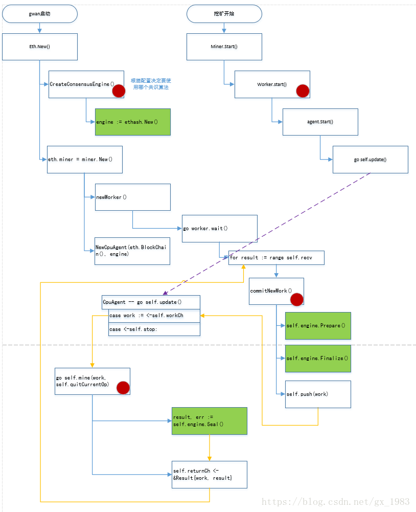

# Node 
## Node struct
```
type Node struct {
    eventmux *event.TypeMux  // 事件多路分发器
    config *Config // Node的配置
    accman  *accounts.Manager // 账户管理器
    ephemeralKeystore string  //临时keystore目录，app停止后会被删除
    instanceDirLock fileutil.Releaser //实例目录锁，防止实例冲突

    serverConfig p2p.Config
    server *p2p.Server  //p2p网络层

    serviceFuncs []ServiceConstructor  //服务的构造数组，依赖关系排序
    services map[reflect.Type]Service  //正在运行的服务

    rpcAPIs  []rpc.API //由node提供的api列表
    ipprocHandler *rpc.Server //处理api请求的进程间RPC请求处理函数

    ipcEndpoint string //IPC端口
    ipcListener net.Listener //IPC rpc监听socket，提供api请求服务

    httpEndPoint string //HTTP端口（interface + point)
    httpWhitelist []string //HTTP白名单
    httpListener net.Listener //HTTP RPC监听socket,提供api请求服务
    httpHandler *rpc.Server //http请求处理函数

    wsEndpoint string
    wsListener net.Listener
    wsHandler *rpc.Server

    stop chan struct {}
    lock sync.RWMutex

    log log.Logger 

}
```
## 分析
1) 事件分发器: eventmux
2) node的配置: config
3) 账户管理器：accman
4) 路径管理用途：epherealKeystore和instanceDirLock
5) p2p网络：serverConfig, server
6) 服务管理：serviceFuncs和services
7) API管理：rpcAPIs和inprocHandler
8) 外部访问：ipc、http、ws相关变量
9) 程序相关：stop，lock和log

# Eth service
## eth struct 
```
type Ethereum struct {
    config *Config
    shutdownChan chan bool //关闭服务的channel
    server *p2p.Server

    txPool  *core.TxPool   //交易内存池
    blockchain *core.BlockChain  //区块链 -- 逻辑上的概念
    protocolManager *protocolManager //协议管理器
    lesServer LesServer

    chainDb ethdb.Database //区块链数据库

    eventMux  *event.TypeMux //事件分发器
    engine     consensus.Engine //共识引擎
    accountManager *accounts.Manager //账户管理器
    bloomRequests chan chan *bloombits.Retrieval // 接收布隆数据恢复请求的channel
    bloomIndexer *core.ChainIndexer  //在块导入时候操作，布隆索引器

    APIBackend *EthAPIBackend  //api后端

    miner   *miner.Miner
    gasPrice *big.Int   //gas价格
    etherbase common.Address //矿工地址

    networkId   uint64 //
    netRPCService *ethapi.PublicNetAPi //
    lock sync.RWMutex
}
```
## 分析
这是以太坊的最核心的结构，主要包括以下内容：

1) 管理相关：config, shutdownChan, networkId, lock
2) p2p网络：server
3) rpc请求：netRPCService, APIBackend
4) 内存池：txPool, blockchain, protocolManager, lesServer
5) 物理存储：chainDB
6) 共识引擎：eventMux, engine
7) 矿工：miner, gasPrice, etherbase
8) 账户管理：accountManager
9) 其他：bloomRequests, bloomIndexer

在该结构中与区块链业务相关的模块包括：交易池txPool，物理存储chainDB，共识引擎engine和矿工miner。

## eth构建过程
1) 创建chainDB: ctx.OpenDatabaseWithFreezer
2) 创建创世块: core.SetupGenesisBlock(chainDb, config.Genesis)
3) 构建Ethereum:
```
eth := &Ethereum {
    config: config,
    chainDb: chainDb,
    eventMux: ctx.EventMux,
    accountManager: ctx.AccountManager,
    engine: CreateConsensusEngine(ctx, chainConfig, &config.Ethash, config.Miner.Notify, config.Miner.Noverify,chainDb), //创建挖矿引擎
    shutdownChan: make(chan bool),
    networkID: make(chan bool),
    gasPrice: config.Miner.GasPrice,
    etherbase: config.Miner.Etherbase,
    bloomRequests: make(chan chan *bloombits.Retrieval);
    bloomIndexer: NewBloomIndexer(chainDb, parmas.BloomBitsBlocks, params.BloomConfirms); //创建布隆过滤器

}
```
在该过程中创建了挖矿引擎

4) 创建vmConfig
5) 创建cacheConfig
6) 创建blockChain: core.NewBlockChain(chainDb, cacheConfig, chainConfig, eth.engine, vmConfig, eth.shouldPreserve);
7) 布隆索引开始：eth.bloomIndexer.Start(eth.blockchain)
8) 创建内存池： core.NewTxPool(config.TxPool, chainConfig, eth.blockchain);
9) 创建子协议管理器：NewProtocolManager,协议管理器负责网络的工作
10）创建矿工：miner.New(eth,&config.Miner, chainConfig, eth.EventMux(), eth.engine,eth.isLocalBlock)
11) 创建APIBackend : &EthAPIBackend
12) 创建gas评估工具：gasprice.NewOracle


# 交易池
```
type TxPool struct {
    config TxPoolConfig
    chainConfig *params.ChainConfig
    chain  blockChain
    gasPrice *big.Int
    txFeed event.Feed
    scope event.SubscriptionScope
    signer types.Signer
    mu  sync.RWMutex

    currentState *state.StateDB //在区块链头保存当前的状态
    pendingNonces *txNoncer     
    currentMaxGas uint64

    locals *accountSet //本地交易的集合，避免因为排除规则而排除
    journal *txJournal //本地交易的的journal,用于备份
    pending map[common.Address]*txList //所有当前可处理的交易
    queue  map[common.Address]*txList //不可处理的交易队列
    beats map[common.Address]*txList time.Time//每一个已知的账户的心跳
    all *txLookup  //所有被查询的交易
    priced *txPriceList //根据价格排序的交易

    chainHeadCh chan ChainHeadEvent
    chainHeadSub event.Subscription
    reqResetCh chan *txPoolResetRequest
    reqPromotech chan *accountSet
    queueTxEventCh chan *types.Transaction
    reorgDoneCh chan chan struct{}
    reorgShutdownCh chan struct{} 
    wg sync.WaitGroup

}
```
# blockChain
```
type BlockChain struct {
    chainConfig *params.ChainConfig
    cacheConfig *CacheConfig

    db ethdb.Database  //low level persistent database to store final content in
    triegc *prque.Prque //
    gcproc time.Duration 

    hc *HeaderChain
    rmLogsFeed event.Feed
    chainFeed event.Feed
    chainSideFeed event.Feed
    chainHeadFeed event.Feed
    logsFeed event.Feed
    blockProcFeed event.Feed
    scope  event.SubscriptionScoper
    genesisBlock *types.Block

    chainmu sync.RWMutex

    currentBlock atomic.Value
    currentFastBlock atomic.Value

    stateCache state.Database 
    bodyCache *lru.Cache  //Cache for the most recent block bodies
    bodyRLPCache *lru.Cache //Cache for the most recent block bodies in RLP encoded format
    receiptsCache *lru.Cache //Cache for the most recent receipts per block
    blockCache *lru.Cache //Cache for the most recent entire blocks
    futureBlocks *lru.Cache // future blocks are blocks added for later processing

    quit chan struct{}
    running int32
    procInterrupt int32
    wg sync.WaitGroup

    engine consenus.Engine
    validator Validator //block and state validator interface
    prefetcher  Prefetcher //Block state prefetcher interface
    processor Processor //Block transactoin processor interface

    vmConfig vm.Config

    badBlocks *lru.Cache
    shouldPreserve func(*types.Block) bool
    terminateInsert func(common.Hash, uint64) bool


}
```
# 挖矿



下面按照流程图说明以太坊挖矿的过程：
1)	运行以太坊客户端程序geth(或者运行wanchain的gwan),启动节点
2)	调用eth.New()函数创建ethereum对象。
3)	eth的New()函数调用函数CreateConsensusEngine()创建共识算法引擎。
4)	共识算法引擎创建完成之后eth.New()接着调用miner.New()创建miner对象，miner对象负责控制挖矿的过程，与其他模块交互，控制挖矿过程的启动及停止等。
5)	在miner.New()函数中调用newWorker()函数创建一个worker对象，然后调用NewCpuAgent()函数创建一个cpuAgent对象。其中worker负责给cpuAgent发送出块需要的数据，CPUAgent才是实际与共识引擎交互负责出块的对象，在其内部调用共识引擎的各种接口来出块，最终cpuAgent把产生的新块返回给worker对象，然后worker对象发送新块上链的通知并同时向它的peer广播新块消息。
6)	worker对象创建之后会创建一个协程go worker.wait()， 此协程负责接收cpuAgent返回给worker的新块，进行新块的处理同时调用commitNewWork()函数发送新的出块请求给cpuAgent对象。
7)	cpuAgent对象创建之后会创建一个协程go self.update()，此协程负责接收从worker对象发送过来的出块请求，cpuAgnet()对象收到新的出块请求之后创建一个协程go self.mine()用于对新区块进行挖掘（对每个新区块的出块请求都会新创建一个协程来执行出块的动作。）
8)	worker对象有一个recv通道，用于从cpuAgent接收挖矿的返回结果;cpuAgent的通道workChan用于从worker对象接收发送过来的用于出块的原始数据，cpuAgent的returnCh指针在cpuAgent创建之后会被赋值为worker对象的recv通道，这样worker和cpuAgent的交互通道就关联了起来：worker把原始数据发送给cpuAgent的workchain通道。cpuAgent把出块结果放到worker的recv通道返回给worker对象。
9)	图示中蓝色的箭头表示代码的静态流程，即各对象的创建逻辑。
10)	实体中黄色的箭头表示消息流向，黄色和蓝色箭头结合起来后挖矿流程就形成了一个闭环。
11)	紫色箭头关联的逻辑为挖矿的开始流程，执行miner.start()开始挖矿，cpuAgent在miner.start(0之后才开始监听workCh通道，等待接收组装区块的原始数据的。


